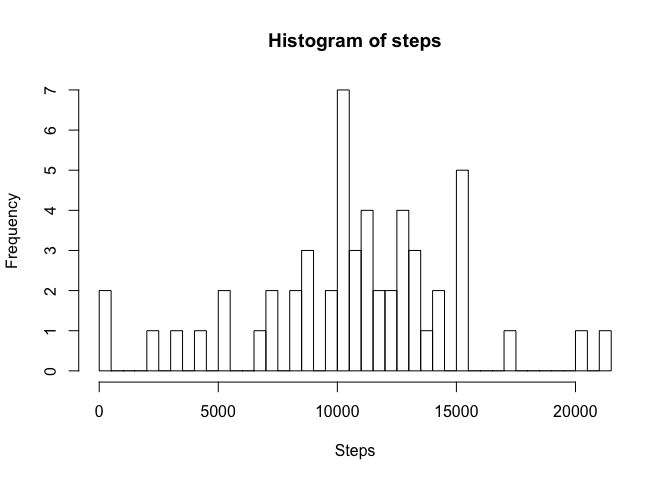
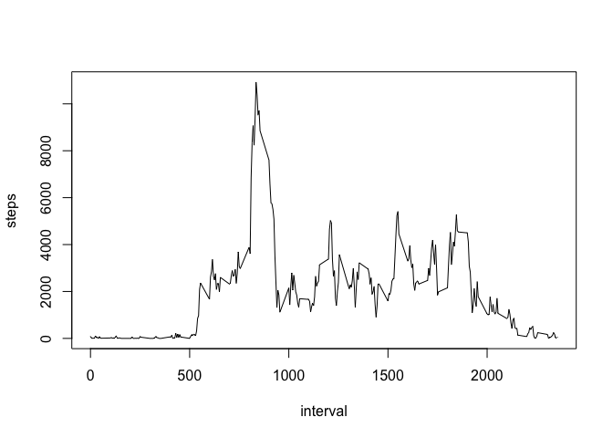

# Reproducible Research: Peer Assessment 1


## Loading and preprocessing the data

* Load the data


```r
unzip("activity.zip")
activity <- read.csv("activity.csv", na.strings = "NA", header = TRUE, quote = "\"")
```

* Process/transform the data (if necessary) into a format suitable for your analysis


```r
activity <- na.omit(activity)
```

## What is mean total number of steps taken per day?

* Calculate the total number of steps taken per day


```r
sum_steps <- aggregate (steps ~ date, data = activity, sum)
```

* Make a histogram of the total number of steps taken each day


```r
hist(sum_steps$steps, xlab = "Steps", main = "Histogram of steps", breaks = 50)
```

<!-- -->

* Calculate and report the mean and median of the total number of steps taken per day


```r
mean(sum_steps$steps)
```

```
## [1] 10766.19
```

```r
median(sum_steps$steps)
```

```
## [1] 10765
```

## What is the average daily activity pattern?

* Make a time series plot of the 5-minute interval (x-axis) and the average number of steps taken, averaged across all days (y-axis)


```r
sum_steps_interval <- aggregate (steps ~ interval, data = activity, sum)
plot(steps ~ interval, data = sum_steps_interval, type = "l")
```

<!-- -->

## Imputing missing values


## Are there differences in activity patterns between weekdays and weekends?
